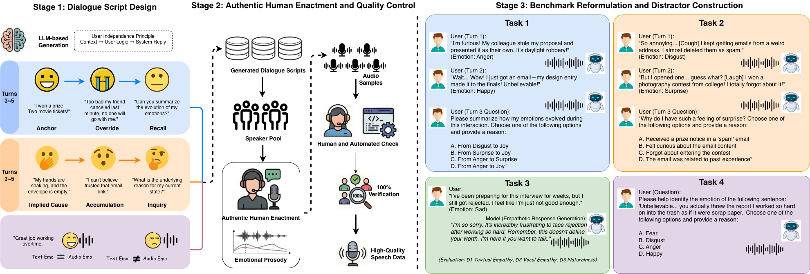

# HumDial-EIBench: A Multi-Turn Emotional Intelligence Benchmark for Audio Language Models

> **Official repository of "HumDial-EIBench: A Multi-Turn Emotional Intelligence Benchmark for Audio Language Models".**

<div align="center">

[](#) 
[](#) 

</div>

<div align="center">
  
  <p><em>Figure 1: Data construction and task overview of HumDial-EIBench. Left: The three-stage construction pipeline encompassing dialogue script design, human performance and quality control, and objective rewriting. Right: Representative examples of the four evaluation tasks.</em></p>
</div>

This is the official repository for the paper **"HumDial-EIBench: A Multi-Turn Emotional Intelligence Benchmark for Audio Language Models"**.

**Dataset and evaluation codes can be accessed anonymously at:** [https://anonymous.4open.science/r/HumDial-EIBench/](#)

## 💡 Abstract
Comprehensive assessment of emotional intelligence in end-to-end spoken dialogue models is important. Traditional evaluation of open-ended generation relies on subjective scoring, which hinders stable quantification of context understanding capabilities, such as tracking emotional changes or inferring underlying causes. To address this issue, this paper proposes HumDial-EIBench, an objective benchmark to evaluate the emotional intelligence of audio language models. Based on the human-recorded test set from the ICASSP 2026 HumDial Challenge, the proposed benchmark transforms emotional trajectory detection and emotional causal reasoning tasks into multiple-choice formats with adversarial distractors, eliminating subjective scoring variants. Furthermore, HumDial-EIBench retains the original empathetic response generation task and introduces an acoustic-semantic conflict recognition task to assess cross-modal perception and empathetic expression. Extensive evaluation results across eight audio language models validate the effectiveness of the proposed benchmark in diagnosing complex interaction capabilities. The results indicate significant room for improvement in multi-turn dialogues and cross-modal alignment among current models.

## 🚀 News
* **[2026.03]** Paper submitted and repository initialized.
* **[2026.03]** HumDial-EIBench dataset uploaded.

## 📊 Dataset: HumDial-EIBench

To address the limitations of existing speech benchmarks, which mostly rely on synthesized speech and lack continuous multi-turn emotional evolution, this paper constructs HumDial-EIBench, a real-recorded, bilingual multi-turn dataset.

The dataset includes 1,077 samples across four tasks. It uses scenarios from the ICASSP 2026 HumDial Challenge, re-annotated for objective evaluation to separate cognitive reasoning from expressive generation.

| Task | Format | CN / EN | Level | Primary Metric |
| :--- | :---: | :---: | :---: | :---: |
| **Task 1: Emotional Trajectory** | Multiple Choice | 150 / 150 | Multi-turn | Accuracy |
| **Task 2: Causal Reasoning** | Multiple Choice | 134 / 149 | Multi-turn | Accuracy |
| **Task 3: Empathetic Generation** | Open Generation | 144 / 150 | Multi-turn | LLM + Human |
| **Task 4: Acoustic-Semantic Conflict** | Multiple Choice | 100 / 100 | Single-turn | Accuracy |
| **Total** | | **528 / 549** | | |

### Dataset Access & Explanation

#### 1. Task 1 & 2 (Objective Multi-Turn Reasoning)
These tasks transform open-ended emotional trajectory tracking and causal reasoning into multiple-choice formats. Adversarial distractors are designed to ensure models differentiate factual developments from genuine emotional drivers and temporal state shifts.
* 🔒 **Availability:** The dataset is currently undergoing anonymous peer review and will be released publicly upon paper acceptance.

#### 2. Task 3 (Empathetic Generation)
Retained from the original ICASSP 2026 challenge, this task requires audio language models to generate empathetic responses. The evaluation separates text-level cognitive empathy (D1) and acoustic-level expressive empathy (D2/D3).

#### 3. Task 4 (Acoustic-Semantic Conflict)
A newly introduced single-turn task. Models must identify true emotional states when the literal semantic content contradicts the acoustic emotional tone (e.g., sarcasm). This task specifically evaluates text-dominance bias.

## 📖 Citation

If you use this benchmark, please consider citing the paper:

```bibtex
@article{HumDialEIBench2026,
  title={HumDial-EIBench: A Multi-Turn Emotional Intelligence Benchmark for Audio Language Models},
  author={Anonymous Authors},
  journal={Anonymous submission},
  year={2026}
}
```
